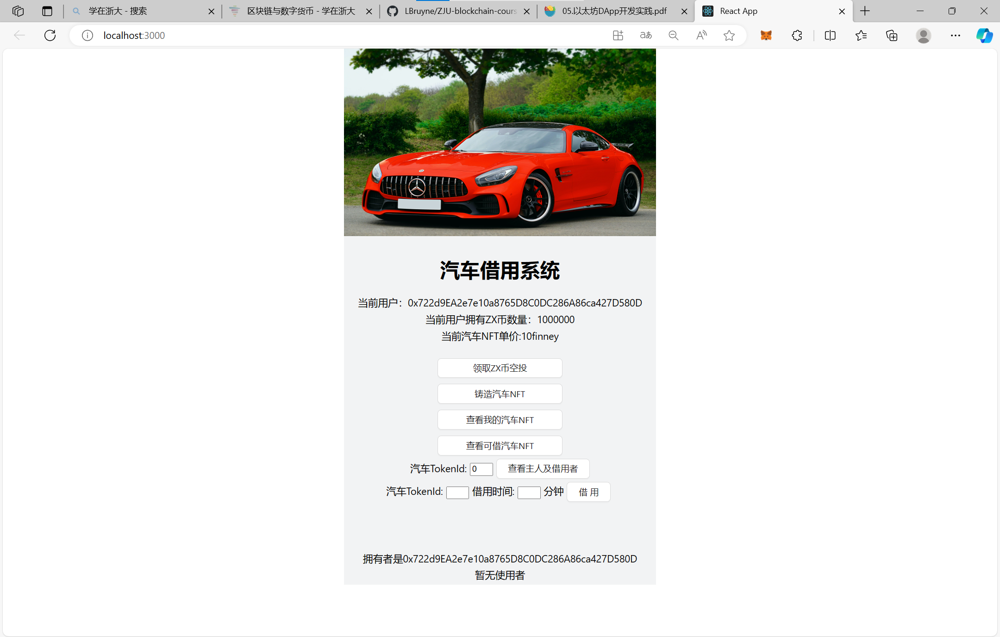

# 汽车借用系统 #

> 汽车借用系统，参与方包括：汽车拥有者，有借用汽车需求的用户
>
> 创建了两个合约 `BorrowYourcar` 和 `MyERC20` 
>
> `BorrowYourCar` 合约主要实现汽车NFT的铸造和借用，基于 `ERC-4907` 
>
> `MyERC20` 合约为用于汽车借用支付的代币合约，基于 `ERC-20` 
>
> - 在网站中，默认每一个用户都可以铸造汽车代币，每一个用户的汽车都可以被借用。每一个用户可以：
>    1. 支付一定的Ether来铸造汽车NFT，单价为10finney。
>    2. 查看自己拥有的汽车列表。
>    3. 查看当前可以被借的汽车列表。
>    4. 查看某一辆车的主人以及当前的借用者（如果有）。
>    5. 借用某一辆可以被借的汽车一定时间，并使用ZX币来进行支付，每分钟收费1ZX币。

## 如何运行 ##

1. 在本地启动ganache应用。

2. 在 `./contracts` 中安装 `hardhat` ，运行如下的命令：

   ```bash
   npm install
   ```

3. 在 `./contracts` 中安装依赖，运行如下的命令：

   ```bash
   npm install -D hardhat
   ```

4. 在 `./contracts` 中编译合约，运行如下的命令：

   ```bash
   npx hardhat compile
   ```

5. 将编译得到的 `./contracts/artifacts` 中的 `contracts/BorrowYourCar.sol/BorrowYourCar.json` `contracts/ERC4907.sol/ERC4907.json` `contracts/IERC4907.sol/IERC.json` `contracts/MyERC20.sol/MyERC20.json` 四个文件复制到 `frontend/src/utils/abis` 文件夹中。

6. 将合约部署到ganache本地链上，在 `./contracts` 中运行如下的命令：

   ```bash
   npx hardhat run ./scripts/deploy.ts --network ganache
   ```

7. 将得到的合约地址复制到 `frontend/src/utils/contract-address.json` 中。

8. 在 `./frontend` 中安装需要的依赖，运行如下的命令：

   ```bash
   npm install
   ```

9. 在 `./frontend` 中安装 `web3 v1.10.0` ，运行如下的命令：

   ```bash
   npm install web3@1.10.0
   ```

10. 在 `./frontend` 中安装 `antd` 依赖，运行如下的命令：

    ```bash
    npm install antd
    ```

11. 在 `./frontend` 中启动前端程序，运行如下的命令：

    ```bash
    npm run start
    ```

## 功能实现分析 ##

- 铸造代币

  1. 调用 `mint` 函数。

- 查看拥有的汽车列表

  1. 实现了一个 `event` ：

     ```solidity
     event GetCarOwned(uint256[]);
     ```

  2. 使用了一个 `mapping` 从车主的 `address` 到拥有的汽车NFT的 `TokenId` 的映射。
  3. 使用 `emit GetCarOwned(uint256[])` 返回拥有的汽车NFT的 `TokenId` 。

- 查看可借用的汽车列表

  1. 实现了一个 `event` ：

     ```solidity
     event GetCarBorrowed(uint256[]);
     ```

  2. 遍历当前所有的 `Token` ，找到所有到期时间在当前时间之前的 `Token` 。
  3. 使用 `emit GetCarBorrowed(uint256[])` 返回当前可借用的汽车NFT的 `TokenId` 。

- 查看某一辆汽车的主人和使用者

  1. 调用 `ownerOf()` 函数。
  2. 调用 `userOf`() 函数。

- 借用一辆车一段时间

  1. 调用 `setUser()` 函数，设置使用者和到期时间。
  2. 调用 `MyERC20.transferFrom()` 函数使用ZX币进行支付。

## 项目运行截图 ##

- 主界面

  

- 领取ZX币空投

  

  

- 铸造汽车NFT

  

  

- 查看我的汽车NFT

  
  
  查看结果：
  
  

- 查看某一辆车的主人和使用者

  

- 借用某一辆车一段时间

  

  

  

## 参考内容 ##

- 课程的参考Demo见：[DEMOs](https://github.com/LBruyne/blockchain-course-demos)。

- ERC-4907 [参考实现](https://eips.ethereum.org/EIPS/eip-4907)